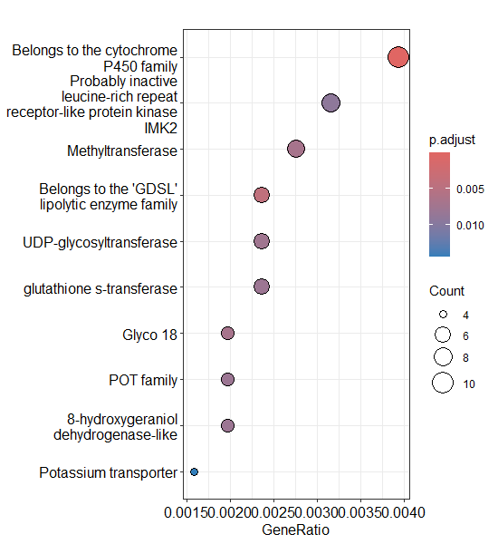
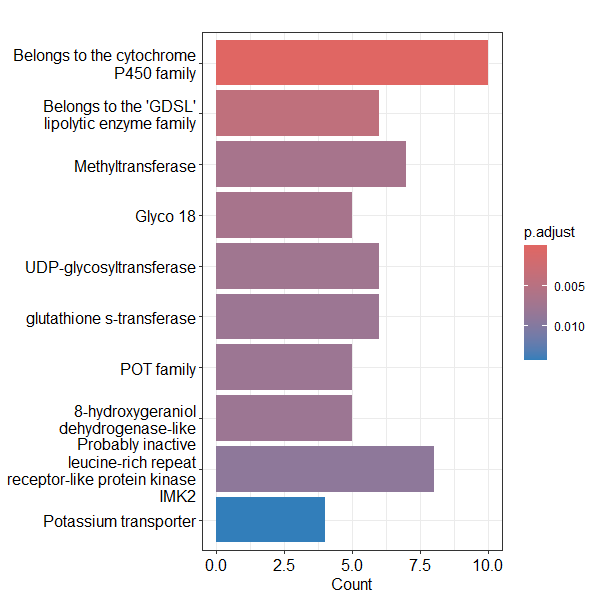
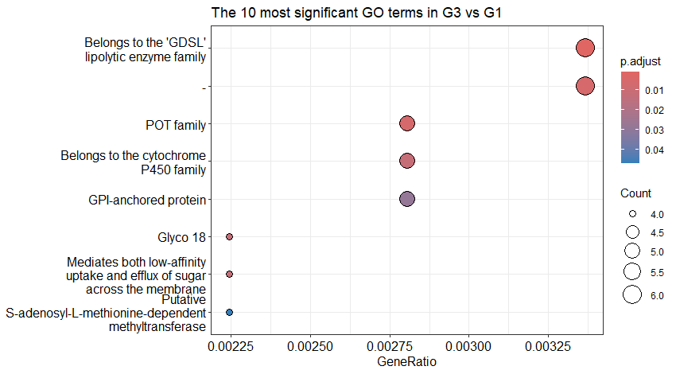
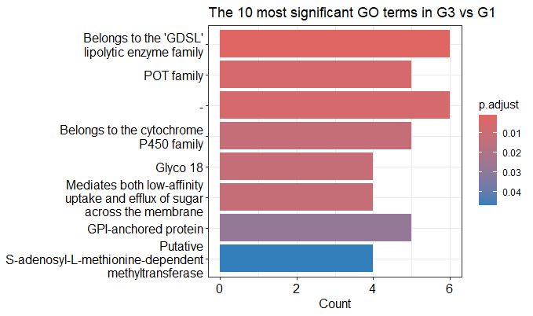
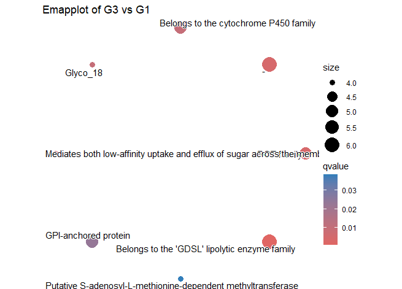

# Transcriptomics_Coffee-Rust_enrichment

# Differential Gene Expression Analysis of Royal Coffee Transcriptome: Low vs High Severity
This project presents a comprehensive workflow for analyzing transcriptomic data from coffee plants infected with rust (Hemileia vastatrix) under different disease severity conditions (Low vs High Severity). The analysis includes:
- Loading raw count matrices and defining experimental groups.
- Differential expression analysis using DESeq2.
- Filtering significant differentially expressed genes (DEGs) with strict criteria (adjusted p-value < 0.05, |log2 fold change| > 1).
- Annotating DEGs with functional categories (COG) using a custom annotation file.
- Generating a summarized functional table comparing up- and down-regulated genes across categories.

## 0. Load required libraries.
```r
library(DESeq2)       # For differential expression analysis
library(tidyverse)    # For data manipulation, joining, summarizing
library(readr)        # Reading CSV/TSV files
library(dplyr)        # Filtering, summarizing
library(clusterProfiler) # ORA analysis
library(DOSE)          # Helper functions for enrichment
```

## 1. Set working directory
```r
setwd("D:/lucianoboa/royatranscriptomics/analysis/featureCounts")
```

## 2. Load count matrix
```r
countData <- read.table("counts_matrix_complete_royatranscriptomics.txt",
                        header = TRUE, row.names = 1, sep = "\t")
```

### Select only count columns (columns 6-21)
```r
countData <- countData[, 6:21]
```

### Rename columns for simplicity
```r
colnames(countData) <- c("H10","H11","H12","H13","H14","H15","H16","H9",
                         "T1","T2","T3","T4","T5","T6","T7","T8")
```

## 3. Define experimental groups (Low vs High severity + Control)
```r
group <- rep(NA, ncol(countData))
names(group) <- colnames(countData)

group[c("H9","H10","H11","H12","H16")] <- "Low_Severity"
group[c("H13","H14","H15")] <- "High_Severity"
group[c("T1","T2","T3","T4","T5","T6","T7","T8")] <- "Control"

# Convert to factor
group <- factor(group)
colData <- data.frame(row.names = colnames(countData), group = group)
```

## 4. DESeq2 analysis
```r
dds <- DESeqDataSetFromMatrix(countData = countData, colData = colData, design = ~ group)

# Filter out low count genes
dds <- dds[rowSums(counts(dds)) > 10, ]

# Run DESeq2
dds <- DESeq(dds)
```

# 5. Extract results for Low vs High Severity
```r
res_Low_vs_High <- results(dds, contrast = c("group", "Low_Severity", "High_Severity"))
res_Low_vs_High <- res_Low_vs_High[order(res_Low_vs_High$padj), ]

# Extract significant DEGs (strict filter)
deg <- subset(res_Low_vs_High, padj < 0.05 & abs(log2FoldChange) > 1)

# Export all DEGs
write.csv(deg, "DEG_Low_vs_High_strict.csv")
```
[Check out the file: DEG_Low_vs_High_strict.csv](DEG_Low_vs_High_strict.csv)


# 6. Separate up- and down-regulated DEGs
```r
deg_df <- as.data.frame(deg)
deg_df$gene_id <- rownames(deg_df)

deg_up <- deg_df %>% filter(log2FoldChange > 1)
deg_down <- deg_df %>% filter(log2FoldChange < -1)

write.csv(deg_up, "Up_DEG_Low_vs_High_strict.csv", row.names = FALSE)
write.csv(deg_down, "Down_DEG_Low_vs_High_strict.csv", row.names = FALSE)
```

[Check out the file: Up_DEG_Low_vs_High_strict.csv](Up_DEG_Low_vs_High_strict.csv)

[Check out the file: Down_DEG_Low_vs_High_strict.csv](Down_DEG_Low_vs_High_strict.csv)


## 7. Load annotation file
```r
annotation <- read_delim("fullAnnotation.tsv.txt", delim = "\t", col_types = cols())

# Fix duplicated column names if needed
colnames(annotation) <- make.unique(colnames(annotation))
```

### Add readable COG names
```r
cog_dict <- c(
  "C" = "Energy production and conversion",
  "D" = "Cell cycle control, cell division, chromosome partitioning",
  "E" = "Amino acid transport and metabolism",
  "F" = "Nucleotide transport and metabolism",
  "G" = "Carbohydrate transport and metabolism",
  "H" = "Coenzyme transport and metabolism",
  "I" = "Lipid transport and metabolism",
  "J" = "Translation, ribosomal structure and biogenesis",
  "K" = "Transcription",
  "L" = "Replication, recombination and repair",
  "M" = "Cell wall/membrane/envelope biogenesis",
  "N" = "Cell motility",
  "O" = "Posttranslational modification, protein turnover, chaperones",
  "P" = "Inorganic ion transport and metabolism",
  "Q" = "Secondary metabolites biosynthesis, transport and catabolism",
  "R" = "General function prediction only",
  "S" = "Function unknown",
  "T" = "Signal transduction mechanisms",
  "U" = "Intracellular trafficking, secretion, vesicular transport",
  "V" = "Defense mechanisms",
  "W" = "Extracellular structures",
  "Y" = "Nuclear structure",
  "Z" = "Cytoskeleton"
)

# Add readable COG name
annotation <- annotation %>%
  mutate(COG_name = cog_dict[COG_category])
```

## 6. Annotate DEGs with COG
```r
deg_up <- as_tibble(deg_up)
deg_down <- as_tibble(deg_down)

deg_up_annot <- deg_up %>%
  left_join(dplyr::select(annotation, gene_id, COG_category, COG_name), by = "gene_id")
deg_down_annot <- deg_down %>%
  left_join(dplyr::select(annotation, gene_id, COG_category, COG_name), by = "gene_id")
```

# 7. Summarize functional categories
```r
# Universe
universe_summary <- annotation %>%
  filter(!is.na(COG_name)) %>%
  group_by(COG_name) %>%
  summarise(Universe = n_distinct(gene_id))

# Up DEGs
up_summary <- deg_up_annot %>%
  filter(!is.na(COG_name)) %>%
  group_by(COG_name) %>%
  summarise(Up = n_distinct(gene_id))

# Down DEGs
down_summary <- deg_down_annot %>%
  filter(!is.na(COG_name)) %>%
  group_by(COG_name) %>%
  summarise(Down = n_distinct(gene_id))
```

### Merge summaries
```r
summary_table <- universe_summary %>%
  full_join(up_summary, by = "COG_name") %>%
  full_join(down_summary, by = "COG_name") %>%
  replace(is.na(.), 0) %>%
  arrange(desc(Universe))

write_csv(summary_table, "Summary_by_COG_categories_Low_vs_High.csv")
print(n=21, summary_table)
```

[Check out the file: Summary_by_COG_categories_Low_vs_High.csv](Summary_by_COG_categories_Low_vs_High.csv)

```r
> print(n=21, summary_table)
# A tibble: 21 × 4
   COG_name                                                     Universe    Up  Down
   <chr>                                                           <int> <int> <int>
 1 Function unknown                                                13943    21     3
 2 Signal transduction mechanisms                                   4176    11     2
 3 Replication, recombination and repair                            3998     2     0
 4 Posttranslational modification, protein turnover, chaperones     3065     6     0
 5 Transcription                                                    2941     3     1
 6 Secondary metabolites biosynthesis, transport and catabolism     2059     4     0
 7 Carbohydrate transport and metabolism                            1974     3     0
 8 Amino acid transport and metabolism                              1621     0     1
 9 Translation, ribosomal structure and biogenesis                  1451     0     0
10 Intracellular trafficking, secretion, vesicular transport        1127     2     0
11 Lipid transport and metabolism                                   1080     1     0
12 Energy production and conversion                                  940     0     0
13 Inorganic ion transport and metabolism                            911     4     0
14 Cell cycle control, cell division, chromosome partitioning        576     0     0
15 Coenzyme transport and metabolism                                 533     0     0
16 Defense mechanisms                                                432     0     0
17 Cytoskeleton                                                      367     0     0
18 Nucleotide transport and metabolism                               305     2     0
19 Cell wall/membrane/envelope biogenesis                            297     2     0
20 Nuclear structure                                                  13     0     0
21 Extracellular structures                                            4     0     0
```


# Differential Gene Expression Analysis of Coffee Transcriptome: Experimental Groups
## Complete example of Group_2 vs Group_1

## Part 1: Over-Representation Analysis

## 0. Load required libraries
```r
library(DESeq2)     # For differential expression analysis
library(tidyverse)  # For data manipulation (optional, useful for merging and plotting)
library(readr)      # For reading TSV/CSV files
library(dplyr)      # For filtering and data manipulation
library(clusterProfiler)  # For enrichment analysis
library(DOSE)         # Helper functions for enrichment
library(enrichplot)   # Visualization of enrichment results
```

## 1. Set working directory
```r
setwd("D:/lucianoboa/royatranscriptomics/analysis/featureCounts")
```

## 2. Load count matrix
```r
countData <- read.table("counts_matrix_complete_royatranscriptomics.txt", 
                        header = TRUE, row.names = 1, sep = "\t")

# Select only count columns (columns 6 to 21)
countData <- countData[, 6:21]

# Rename columns for simplicity
colnames(countData) <- c("H10","H11","H12","H13","H14","H15","H16","H9",
                         "T1","T2","T3","T4","T5","T6","T7","T8")
```


## 3. Define experimental groups
```r
group <- rep(NA, ncol(countData))
names(group) <- colnames(countData)

group[c("T1","T2","T3","T4","T5","T6","T7","T8")] <- "Group_1"
group[c("H9","H11","H13","H14","H15","H16")] <- "Group_2"
group[c("H10","H12")] <- "Group_3"

group <- factor(group)

# Create colData for DESeq2
colData <- data.frame(row.names = colnames(countData),
                      group = group)
```


## 4. Create DESeq2 dataset
```r
dds <- DESeqDataSetFromMatrix(countData = countData, 
                              colData = colData, 
                              design = ~ group)
```


## 5. Filter low-expression genes
```r
dds <- dds[rowSums(counts(dds)) > 10,]
```

## 6. Run DESeq2 differential expression
```r
dds <- DESeq(dds)
```


## 7. Extract contrasts / results
```r
res_G2vsG1 <- results(dds, contrast = c("group", "Group_2", "Group_1"))
res_G3vsG1 <- results(dds, contrast = c("group", "Group_3", "Group_1"))
res_G2vsG3 <- results(dds, contrast = c("group", "Group_2", "Group_3"))

# Order by adjusted p-value
res_G2vsG1 <- res_G2vsG1[order(res_G2vsG1$padj), ]
res_G3vsG1 <- res_G3vsG1[order(res_G3vsG1$padj), ]
res_G2vsG3 <- res_G2vsG3[order(res_G2vsG3$padj), ]
```

## 8. Extract DEGs with strict filtering
```r
deg_G2vsG1 <- subset(res_G2vsG1, padj < 0.05 & abs(log2FoldChange) > 1)
deg_G3vsG1 <- subset(res_G3vsG1, padj < 0.05 & abs(log2FoldChange) > 1)
deg_G2vsG3 <- subset(res_G2vsG3, padj < 0.05 & abs(log2FoldChange) > 1)
```


## 9. Export DEGs
```r
# G2 vs G1
write.csv(deg_G2vsG1, file = "DEG_G2_vs_G1_strict.csv")
write.csv(subset(deg_G2vsG1, log2FoldChange > 1), file = "Up_DEG_G2_vs_G1_strict.csv")
write.csv(subset(deg_G2vsG1, log2FoldChange < -1), file = "Down_DEG_G2_vs_G1_strict.csv")

# G3 vs G1
write.csv(deg_G3vsG1, file = "DEG_G3_vs_G1_strict.csv")
write.csv(subset(deg_G3vsG1, log2FoldChange > 1), file = "Up_DEG_G3_vs_G1_strict.csv")
write.csv(subset(deg_G3vsG1, log2FoldChange < -1), file = "Down_DEG_G3_vs_G1_strict.csv")

# G2 vs G3
write.csv(deg_G2vsG3, file = "DEG_G2_vs_G3_strict.csv")
write.csv(subset(deg_G2vsG3, log2FoldChange > 1), file = "Up_DEG_G2_vs_G3_strict.csv")
write.csv(subset(deg_G2vsG3, log2FoldChange < -1), file = "Down_DEG_G2_vs_G3_strict.csv")
```

## 10. Load DEGs
```r
diff_genes <- read_delim("Up_DEG_G2_vs_G1_strict.csv", delim = ",")
colnames(diff_genes)[1] <- "gene_id"       # Rename first column
diff_genes <- diff_genes[, c("gene_id", "log2FoldChange")]
```


## 11. Load full annotation file (LOC IDs)
```r
annotation <- read_delim("fullAnnotation.tsv.txt", delim = "\t", col_types = cols())
```

Assume at least these columns exist: "gene_id" (LOC###), "GO", "description"

## 12. Filter annotation for DEGs
```r
deg_annot <- annotation %>%
  filter(gene_id %in% diff_genes$gene_id)
# Split multiple GO terms separated by ";" and create vector
deg_genes_GO <- deg_annot$GOs %>%
  strsplit(split = ";") %>%
  unlist() %>%
  unique()
```


## 13. Define universe of genes (all detected genes)
```r
all_genes <- annotation$gene_id
all_genes_GOs <- annotation$GOs %>%
  strsplit(split = ";") %>%
  unlist() %>%
  unique()
```

## 14. Perform Over-Representation Analysis (ORA) with clusterProfiler
```r
ora_GOs <- enricher(
  gene = deg_genes_GO,
  universe = all_genes_GOs,
  pAdjustMethod = "BH",
  qvalueCutoff = 0.05,
  TERM2GENE = annotation[, c("GOs", "gene_id")],    # Map GO → gene
  TERM2NAME = annotation[, c("GOs", "Description")] # Optional, GO names
)

deg_gene_ids <- deg_annot$gene_id
term2gene <- annotation[, c("GOs", "gene_id")]  # ajusta "GOs" al nombre exacto de tu columna GO
term2name <- annotation[, c("GOs", "Description")]  # opcional

ora_GOs <- enricher(
  gene = deg_gene_ids,         # vector de genes, no GO
  universe = all_genes,        # vector de todos los genes detectados
  pAdjustMethod = "BH",
  qvalueCutoff = 0.05,
  TERM2GENE = term2gene,
  TERM2NAME = term2name
)
```

## 15. Results. 
```r
# Number of significant GO terms.
sum(ora_GOs@result$p.adjust < 0.05)
```

```r
[1] 21
```

# Dotplot of the 10 most significant GOs of Group_2 vs Group_1
```r
dotplot(ora_GOs, showCategory = 10)
```


# Barplot of the 10 most significant GOs of Group_2 vs Group_1
```r
barplot(ora_GOs, showCategory = 10)
```



# Enrichment map of Group_2 vs Group_1
```r
ora_GOs <- pairwise_termsim(ora_GOs, method = "JC")
emapplot(ora_GOs, color = "qvalue", showCategory = 15)
```
emapplot aqui no funciono

## Part 2: Functional categories 

## 1. Add readable COG names
```r
cog_dict <- c(
  "C"="Energy production and conversion", "D"="Cell cycle control, cell division, chromosome partitioning",
  "E"="Amino acid transport and metabolism", "F"="Nucleotide transport and metabolism",
  "G"="Carbohydrate transport and metabolism", "H"="Coenzyme transport and metabolism",
  "I"="Lipid transport and metabolism", "J"="Translation, ribosomal structure and biogenesis",
  "K"="Transcription", "L"="Replication, recombination and repair",
  "M"="Cell wall/membrane/envelope biogenesis", "N"="Cell motility",
  "O"="Posttranslational modification, protein turnover, chaperones",
  "P"="Inorganic ion transport and metabolism", "Q"="Secondary metabolites biosynthesis, transport and catabolism",
  "R"="General function prediction only", "S"="Function unknown",
  "T"="Signal transduction mechanisms", "U"="Intracellular trafficking, secretion, vesicular transport",
  "V"="Defense mechanisms", "W"="Extracellular structures", "Y"="Nuclear structure", "Z"="Cytoskeleton"
)

# Add readable COG name
annotation <- annotation %>%
  mutate(COG_name = cog_dict[COG_category])
```

## 2. Annotate DEGs with COG
```r
deg_up_annot <- deg_up %>% left_join(dplyr::select(annotation, gene_id, COG_category, COG_name), by="gene_id")
deg_down_annot <- deg_down %>% left_join(dplyr::select(annotation, gene_id, COG_category, COG_name), by="gene_id")
```

## 3. Summarize functional categories
```r
universe_summary <- annotation %>%
  filter(!is.na(COG_name)) %>%
  group_by(COG_name) %>%
  summarise(Universe = n_distinct(gene_id))

up_summary <- deg_up_annot %>%
  filter(!is.na(COG_name)) %>%
  group_by(COG_name) %>%
  summarise(Up = n_distinct(gene_id))

down_summary <- deg_down_annot %>%
  filter(!is.na(COG_name)) %>%
  group_by(COG_name) %>%
  summarise(Down = n_distinct(gene_id))
```

## 4. Merge summaries
```r
summary_table <- universe_summary %>%
  full_join(up_summary, by="COG_name") %>%
  full_join(down_summary, by="COG_name") %>%
  replace(is.na(.), 0) %>%
  arrange(desc(Universe))

write_csv(summary_table, "Summary_COG_categories_G2_vs_G1.csv")
print(summary_table, n=21)
```

[Check out the file: Summary_COG_categories_G2_vs_G1.csv](Summary_COG_categories_G2_vs_G1.csv)

```r
# A tibble: 21 × 4
   COG_name                                                     Universe    Up  Down
   <chr>                                                           <int> <int> <int>
 1 Function unknown                                                13943   712  1332
 2 Signal transduction mechanisms                                   4176   235   452
 3 Replication, recombination and repair                            3998    55    92
 4 Posttranslational modification, protein turnover, chaperones     3065   126   346
 5 Transcription                                                    2941   204   205
 6 Secondary metabolites biosynthesis, transport and catabolism     2059   191   236
 7 Carbohydrate transport and metabolism                            1974   179   222
 8 Amino acid transport and metabolism                              1621   101   146
 9 Translation, ribosomal structure and biogenesis                  1451    32   195
10 Intracellular trafficking, secretion, vesicular transport        1127    70    62
11 Lipid transport and metabolism                                   1080    82    89
12 Energy production and conversion                                  940    73   174
13 Inorganic ion transport and metabolism                            911    88   108
14 Cell cycle control, cell division, chromosome partitioning        576    12    21
15 Coenzyme transport and metabolism                                 533    28    92
16 Defense mechanisms                                                432    33    54
17 Cytoskeleton                                                      367    18    22
18 Nucleotide transport and metabolism                               305    29    39
19 Cell wall/membrane/envelope biogenesis                            297    16    46
20 Nuclear structure                                                  13     1     3
21 Extracellular structures                                            4     0     1
```


## 5. You can repeat the protocol with other groups. 

### Results

#### Group_3 vs Group_1

Number of significant GO terms of Group_3 vs Group_1.
```r
sum(ora_GOs@result$p.adjust < 0.05)
```
```r
[1] 8
```

Dotplot of the 10 most significant GOs of Group_3 vs Group_1.
```r
dotplot(ora_GOs, showCategory = 10)
```


Barplot of the 10 most significant GOs of Group_3 vs Group_1.
```r
barplot(ora_GOs, showCategory = 10)
```


Enrichment map  of Group_3 vs Group_1. 
```r
ora_GOs <- pairwise_termsim(ora_GOs, method = "JC")
emapplot(ora_GOs, color = "qvalue", showCategory = 15) 
```


Summary of the up and down-regulated genes on different COG_category of Group_3 vs Group_1.
```r
> print(n=21, summary_table)
# A tibble: 21 × 4
   COG_name                                                     Universe    Up  Down
   <chr>                                                           <int> <int> <int>
 1 Function unknown                                                13943    21     3
 2 Signal transduction mechanisms                                   4176    11     2
 3 Replication, recombination and repair                            3998     2     0
 4 Posttranslational modification, protein turnover, chaperones     3065     6     0
 5 Transcription                                                    2941     3     1
 6 Secondary metabolites biosynthesis, transport and catabolism     2059     4     0
 7 Carbohydrate transport and metabolism                            1974     3     0
 8 Amino acid transport and metabolism                              1621     0     1
 9 Translation, ribosomal structure and biogenesis                  1451     0     0
10 Intracellular trafficking, secretion, vesicular transport        1127     2     0
11 Lipid transport and metabolism                                   1080     1     0
12 Energy production and conversion                                  940     0     0
13 Inorganic ion transport and metabolism                            911     4     0
14 Cell cycle control, cell division, chromosome partitioning        576     0     0
15 Coenzyme transport and metabolism                                 533     0     0
16 Defense mechanisms                                                432     0     0
17 Cytoskeleton                                                      367     0     0
18 Nucleotide transport and metabolism                               305     2     0
19 Cell wall/membrane/envelope biogenesis                            297     2     0
20 Nuclear structure                                                  13     0     0
21 Extracellular structures                                            4     0     0
```
